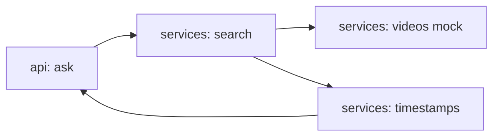

# rag-youtube

[](https://github.com/Shamanchi/rag-youtube/actions/workflows/ci.yml)
[](https://www.python.org/)
[](./Dockerfile)
[](./LICENSE)

> **English TL;DR:** FastAPI YouTube-transcript RAG: mock videos with timestamped segments, keyword search across transcripts, answers with [mm:ss] citations. Fully offline, no tokens needed.

RAG по YouTube-транскриптам: mock-видео с сегментами по таймингам, поиск по транскриптам, ответы с цитатами [mm:ss]. Работает офлайн.

Источник темы: `Hands-On-AI-Engineering / P-166 (rag_apps/youtube_transcript_rag)` — идею и постановку взяли из каталога, код и тексты написаны с нуля.

## Какую задачу решает

Нужно найти момент в видео без просмотра: агент ищет по транскриптам всех видео, возвращает релевантные сегменты с таймингами и собирает ответ.

## Архитектура



Слои: `api/` → `services/` → `core/`, настройки через `pydantic-settings`.

## Быстрый старт

```bash
cp .env.example .env
pip install -r requirements.txt
uvicorn app.main:app --reload
curl -X POST http://127.0.0.1:8000/api/v1/ask -H "Content-Type: application/json" -d "{\"question\": \"How to build the index?\"}"
```

Docker:

```bash
docker compose up --build
```

## API

- `GET /api/v1/health` — проверка сервиса.
- `GET /api/v1/videos` — видео, фильтр `?q=vector`.
- `GET /api/v1/videos/{video_id}` — транскрипт видео.
- `POST /api/v1/ask` — вопрос. Тело: `{"question": "..."}`. Ответ: `answer`, `segments` (video, stamp, text).

Пример ответа `ask` (сокращённо):

```json
{
  "answer": "Welcome, today we index vectors for search [00:00].",
  "segments": [{"video": "Vector DB crash course", "stamp": "00:00", "text": "..."}]
}
```

## Переменные окружения (.env)

| Переменная | Назначение | По умолчанию |
|---|---|---|
| `TOP_K` | Сегментов в ответе | `3` |
| `MIN_SCORE` | Минимальный скор сегмента | `1.0` |
| `APP_HOST` / `APP_PORT` | Хост/порт API | `0.0.0.0` / `8000` |

Полный список — в [.env.example](./.env.example).

## Тесты

```bash
pip install -r requirements.txt
pytest -q
pytest -q -m integration
```

Unit-тесты без сети. Интеграционные (`-m integration`) — через TestClient, тоже без сети.

## Контакты

- Telegram: @PavelYrevichh
- Email: Lietman46@mail.ru
- GitHub: Shamanchi
- FL.ru: https://www.fl.ru/users/Shamanchi
